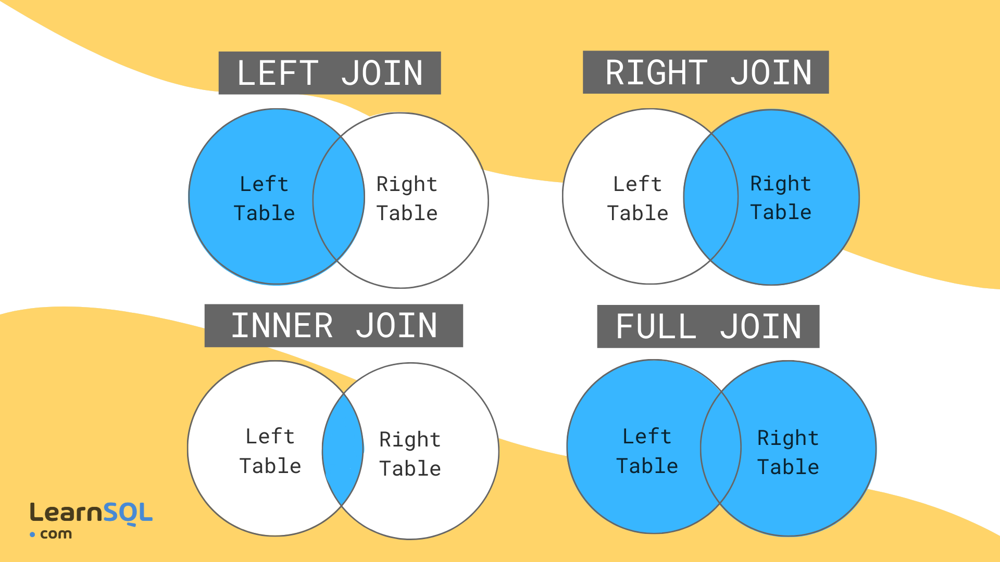

# SQL

## Comandos Principales

###

```sql
SHOW DATABASE
```

- Mostrar todas las bases de datos

###

```sql
CREATE DATABASE nombredb
```

- Crear base de datos

###

```sql
DROP DATABASE nombredb
```

- borra una base de datos

## Operadores De Sentencias

### `IF EXISTS`

- Sí existe ejecutar script

### `IF NOT EXISTS`

- Sí no existe ejecutar script

## Crear Usuario Para Una BD

- Normalmente esto lo hace quien está administrando la base de datos, para otorgar permisos a quienes quieran trabajar con nuestra db

```sql
CREATE USER 'usuario@dominiodb.com' IDENTIFIED BY '(contraseña)'
```

- Para ingresar a la base de datos con el nombre de usuario creado desde la terminal:

```cmd
mysql -u (usuario) -p
```

e ingresar la contraseña asignada

- Esto no significa que nuestro usuario vaya a tener acceso a nuestras base de datos, para esto es necesario asignarles permisos

### Algunos comandos para dar privilegios

- Otorgar todos los privilegios al usuario asignado.

```sql
GRANT ALL PRIVILEGES ON (Nombre DB) TO 'usuario@dominioDB.com'
```

- Unas vez asignado cualquier privilegio, por buena practica, es necesario actualizar nuestra base de datos. Para esto existe el siguiente comando:

```sql
FLUSH PRIVILEGES;
```

- Ver los privilegios que tiene un usuario:

```sql
SHOW GRANTS FOR 'usuario@dominioDB.com';
```

- Para quitar privilegios

```sql
REVOKE ALL GRANT OPTION FROM 'usuario@dominiodb.com';
```

- Eliminar usuario

```sql
DROP USER 'usuario@dominiodb.com'
```

## Tablas

- Crear tabla:

```sql
CREATE TABLE (nombre)
```

- Elegir nuestra db que vamos a trabajar:

```sql
USE nombre_db
```

- Ver tablas de la db:

```sql
SHOW TABLES
```

- Crear una tabla: **CREATE nombreTabla (atributos con sus tipos de datos)**. Ej:

```sql
CREATE usuarios(nombre VARCHAR, correo VARCHAR)
```

- Describir una tabla:

```sql
DESCRIBE (nombre de la tabla)
```

### Agregar, Modificar o Eliminar Atributos De Una Tabla

- Agregar atributos:

```sql
ALTER TABLE (tabla) ADD COLUMN (atributo + tipo de datos)
```

- Modificar un tipo de datos:

```sql
ALTER TABLE (tabla) MODIFY (atributo existente + tipo de dato nuevo)
```

- Renombrar un atributo de una tabla.

```sql
ALTER TABLE (tabla) RENAME COLUMN (atributo) TO (nuevo nombre)
```

- Eliminar un atributo de una tabla.

```sql
ALTER TABLE (tabla) DROP COLUMN (atributo)
```

### CRUD de datos en una tabla

- Agregar datos a una tabla:

```sql
INSERT INTO (tabla) VALUES (valores separados por comas)
```

**NOTA:**
_Usar este metodo puede ser una mala practica ya que hay que saber el orden que estan los datos, como buena practica se usa:_

```sql
INSERT INTO (nombre de los atributos a ingresar datos)
VALUES (datos a ingresar)
```

- Recordar que los datos autoincrementables no es necesario asignarles valor.

- Leer todos los datos de una tabla:

```sql
SELECT * FROM (tabla)
```

## Funciones, Operadores Y Clausulas en DB

### `COUNT()`

- Contador segun una condición. Ej: Todos los usuarios de una db:

```sql
SELECT COUNT(*) FROM usuarios
```

### `AS`

- Para darle un _Alias_ a cada operacion hecha por una funcion de db podemos usar el operador **AS** ej:

```sql
SELECT COUNT(*) AS total_usuarios FROM usuarios
```

### `WHERE`

- Hacer algo cuando se cumpla una condicion Ej:

```sql
SELECT * FROM usuarios WHERE nombre="Leandro";
```

### `IN`

- Para buscar segun varios datos. Ej:

```sql
SELECT * FROM usuarios
WHERE nombre
IN (nombres de personas a buscar el registro)
```

Esto devuelve las comunas que cumplan con los datos agregados.

### `LIKE`

- Para buscar un patron especifico dentro de una columna en una consulta. Se definen usando dos comodines principales.

1. `%`: Coincide con cualquier secuencia de caracteres. Puede ser usado al inicio o al final de una cadena.

- `'A%'` cualquier valor que comience con 'A'. Ej:

```sql
SELECT * FROM usuarios WHERE nombre LIKE 'A%'
```

- `'%A'` cualquier valor que termine con 'A'.
- `'%A%'` cualquier valor que contenga con 'A'.

2. `_`:(Guion Bajo) Coicide con un **solo caracter**.

- `'A_n_'` Coincidirá con cualquier cadena que tenga cuatro caracteres, donde el primero sea 'A', el segundo sea cualquier carácter, el tercero sea 'n' y el cuarto sea cualquier carácter (como 'Ana', 'Aní').

- Operador `NOT LIKE` hace lo inverso.

### ``LIMIT``

> Se utiliza para restringir el número de filas devueltas por una consulta
````sql
SELECT * 
FROM empleados
LIMIT 5;
````
``LIMIT`` **con desplazamiento** ``OFFSET``
> También puedes combinar LIMIT con OFFSET para saltar una cantidad específica de filas antes de empezar a devolver los resultados.

````sql
SELECT * 
FROM empleados
LIMIT 5 OFFSET 5;
````
- **OFFSET 5**: Es el número de filas que se omitirán antes de comenzar a devolver las filas solicitadas.

Ejemplo con ``ORDER BY`` y ``LIMIT``

````sql
SELECT nombre, fecha_contratacion
FROM empleados
ORDER BY fecha_contratacion DESC
LIMIT 3;
````


### Operadores Relacionales

- **Los operadores relacionales** en SQL son utilizados para realizar comparaciones entre valores y son fundamentales en las consultas para filtrar o evaluar datos.

- **Principales Operadores Relacionales**

1. `=` (Igual a):

- Compara si dos valores son iguales.

2. `<> o !=` (diferente de):

- Compara si dos valores son diferentes.

3. `< o >` (Mayo que o Menor que):

- Compara si el valor de la izq es menor o mayor que el de la derecha

4. `BEETWEEN` (Entre un rango de valores):

- Verifica si un valor está entre dos valores, inclusivo. Ej:

```sql
SELECT * FROM usuarios WHERE edad BETWEEN 20 AND 29
```

5. `IS NULL` y `IS NOT NULL` (Comparación de valores nulos):

- Verifica si un valor es **NULL** o NO es **NULL**. Ej:

```sql
SELECT * FROM usuarios WHERE direccion IS NULL
```

### Operadores Lógicos

- Se usan para combinar multiples condiciones en una consulta. Permiten aplicar lógica condicional (como "y","o","no") para filtrar resultados basados en múltiples criterios.

- **Principales Operadores Lógicos en SQL:**

1. `AND` (Y lógico):

- Devuelve **TRUE** si ambas condiciones son verdaderas.
- Cobinar múltiples condiciones en una consulta. Ej:

```sql
SELECT * FROM usuarios
WHERE edad > 26
AND nombre LIKE 'LE%'
```

Devuelve todos los valores mayores a 26 y que el nombre empiece con 'LE'.

2. `OR` (O Lógico):

- Devuelve **TRUE** si alguna de las condiciones es verdadera.

3. `NOT` (Negación Lógica):

- Invierte el resultado de una condición, devolviendo **TRUE** cuando la condición es **FALSE** y viceversa.

- **NOTA**: _En consultas más complejas, es recomendable usar parentisis_:

```sql
SELECT * FROM empleados
WHERE (salario > 2000 OR departamento_id = 3)
AND NOT nombre = 'Carlos';
```

## Sentencia `UPDATE`

- Se utiliza para modificar los datos existentes en una o más filas de una tabla. Puedes actualizar valores de una o más columnas y aplicar condiciones para determinar qué filas se van a modificar.

```sql
UPDATE usuarios
SET correo = "leandro96@gmail.com", direccion = "Solo existo"
WHERE usuario_id = 1;
```

### _NOTAS IMPORTANTES_:

- **Cláusula** `WHERE`: Es muy importante usar la cláusula `WHERE` para evitar modificar todas las filas de la tabla por accidente.

- **Restricciones y llaves foráneas:** Asegurarse de que cualqier modificación NO viole las restricciones de la DB, como llaves foráneas, únicas o cualquier otra restricción.

- **Reversibilidad**: Una vez realizada la sentencia `UPDATE`, no se puede deshacer directamente. Por eso es recomendable realizar **BACKUPS** antes de hacer cambios masivos.

## `DELETE`

- Borrar datos en una o mas filas
- Tambien hay que tener en cuenta usar la cláusula `WHERE` si nó te podes mandar el moco de tu vida :).

```sql
DELETE FROM usuarios WHERE usuario_id = 2;
```

## `TRUNCATE`

- Para reiniciar toda la tabla desde cero (teniendo en cuenta lo id auto incrementables)

```sql
TRUNCATE TABLE usuarios;
```

## Funciones Matemáticas

### Modulo o Residuo de una División

```sql
SELECT MOD(3,2)
```

### Redondeo a +1

```sql
SELECT CEILING(7.1)
```

- Resultado: 8

### Redondeo a -1

```sql
SELECT FLOOR(7.9)
```

- Resultado: 7

### Redondeo a -0.5 o +0.5

```sql
SELECT ROUND(7.5)
```

- Resultado: 8

```sql
SELECT ROUND(7.4999)
```

- Resultado: 7

### Potencia

```sql
SELECT POWER(2,3)
```

- Resultado: 8

### Raiz

```sql
SELECT SQRT(81)
```

## Por qué es importante saber esto?

> Podemos realizar operaciones entre atributos, siempre que tengan el mismo tipo de datos. Por ejemplo, si una tabla de ventas de productos tenemos por un lado el precio de cada producto y la cantidad que se vendio, podemos ahorrarnos algo de logica de programación de nuestro backend y realizar la operacion en nuestra base de datos para calcular las ganancias totales. Ej:

```sql
SELECT nombre, precio, cantidad, (precio * cantidad) AS ganancia
FROM productos;
```

### Funciones de Agrupamiento

- `MAX()` : EL maximo de algo

```sql
SELECT MAX(precio) AS precio_maximo FROM products;
```

- `MIN()` : EL minimo de algo

```sql
SELECT MIN(precio) AS precio_minimo FROM products;
```

- `SUM()` : Sumatoria de todos los datos de un atributo dentro de una tabla

```sql
SELECT SUM(cantidad) AS cantidad_total FROM products;
```

- `AVG()` : Promedio total

```sql
SELECT AVG(Precio) AS promedio_total FROM products;
```

## ``GROUP BY``

> Se utiliza para agrupar filas que tienen valores idénticos en una o más columnas. Luego, se pueden aplicar funciones de agrupamiento como ``COUNT()``, ``SUM()``, etc. Para realizar cálculos sobre cada grupo de datos.

````sql
SELECT nombre, precio, MAX(precio) AS precio_max 
FROM productos 
GROUP BY nombre, precio
````

## ``HAVING``

> Se utiliza para filtrar los resultados de una consulta después de aplicar las funciones de agrupación o agregación en combinación con la cláusula ``GROUP BY``. A diferencia del ``WHERE``, que se usa para filtrar filas antes de la agregación, ``HAVING`` se aplica después de los grupos han sido formados.

````sql
SELECT nombre, precio, MAX(precio) AS precio_max 
FROM productos 
GROUP BY nombre, precio 
HAVING precio_max >= 10000;
````

## ``DISTINCT``

> Se utiliza para eliminar filas duplicadas de los resultados de una consulta, devolviendo solo valores únicos en las columnas especificadas. Es útil cuando deseas obtener una lista de valores distintos sin repetir entradas.

````sql
SELECT DISTINCT nombre 
FROM productos
````

> **Resultado**: Nombre de productos UNICOS.

## ``ORDER BY``

>  Se utiliza para ordenar los resultados de una consulta en función de una o más columnas. Puedes ordenar los resultados en orden **ascendente** ``ASC`` o **descendente** ``DESC``.

````sql
SELECT nombre, precio 
FROM productos 
ORDER BY nombre ASC;
````
- **Resultado**: Tabla con el nombre y precio, Ordenada de forma ascendente por el nomrbre.

> Tambien se puede ordenar segun una condición usando `WHERE` o `HAVING` pero siempre ``ORDER BY``va al final de la consulta sql.

## ``INDEX``

> Un índice en SQL es una estructura de datos que mejora la velocidad de las operaciones de consulta en una tabla. Funciona como un índice en un libro, permitiendo acceder más rápidamente a las filas de una tabla en función de los valores de una o más columnas. Sin embargo, aunque los índices mejoran la lectura de datos, pueden hacer que las operaciones de escritura (inserciones, actualizaciones y eliminaciones) sean más lentas debido a que los índices también deben mantenerse actualizados.

### Tipos de índices

1. Índice Primario ``(PK)``:
- Se crea automáticamente cuando se define una columna como clave primaria.
- Es único y no permite valores nulos.
````sql
CREATE TABLE productos (
   producto_id INT PRIMARY KEY,
   nombre VARCHAR(100)
);
````
2. Índice único ``(UQ)``:
- Garantiza que los valores en una columna o conjunto de columnas sean únicos.
- No permite valores duplicados, pero sí permite valores nulos (con algunas excepciones en diferentes SGBD).
````sql
CREATE UNIQUE INDEX idx_nombre_unico
ON productos(nombre);
````
3. Índice no único **(normal)**:
- Se usa para mejorar el rendimiento de las consultas, pero permite valores duplicados.
````sql
CREATE INDEX idx_nombre
ON productos(nombre);
````
4. Índice compuesto:
- Se crea en más de una columna para optimizar consultas que involucran múltiples columnas.
- El orden de las columnas en el índice es importante, ya que se optimiza para consultas que utilizan las columnas en ese orden.
````sql
CREATE INDEX idx_nombre_descripcion
ON productos(nombre, descripcion);
````
5. Índice de texto completo (Full-text index):
- Se utiliza para optimizar la búsqueda de texto en columnas que contienen grandes volúmenes de texto, como artículos o descripciones.
- Permite realizar búsquedas eficientes sobre texto extenso.
````sql
CREATE FULLTEXT INDEX idx_descripcion
ON productos(descripcion);
````

## Llave o Claves Foraneas

> Es una columna o un conjunto de columnas que establece una relación entre dos tablas. La clave foránea en una tabla se utiliza para garantizar que los valores en una columna o conjunto de columnas coicidan con los valores de la clave primaria en otra tabla. Esto asegura la **integridad referencial** en la DB.

### Por qué usar claves foráneas?

- Para establecer relaciones entre tablas (como una relación de uno a muchos, uno a uno, o muchos a muchos).
- Para asegurar que los valores en una columna de una tabla se correspondan con los valores en la clave primaria de otra tabla.
- Para mantener la integridad referencial: Esto significa que no puedes insertar un valor en una columna de clave foránea si ese valor no existe en la tabla relacionada.

### Como crear una clave foránea

> Al definir una tabla, puedes agregar una clave foránea utilizando la instrucción ``FOREING KEY``

````sql
CREATE TABLE nombre_tabla (
  columna1 INT PRIMARY KEY,
  columna2 VARCHAR(255),
  columna3 INT,
  FOREIGN KEY (columna3) REFERENCES otra_tabla(columna_otra_tabla)
);
````
## ``JOIN``
>``JOIN`` en SQL se utiliza para combinar filas de dos o más tablas basándose en una condición relacionada. Normalmente, esta condición es una clave común entre las tablas (por ejemplo, una clave primaria y una clave foránea). Existen varios tipos de ``JOIN`` para diferentes situaciones.

### Tipos de ``JOIN`` en SQL




1. ``INNER JOIN``:
- Devuelve solo las filas donde hay coincidencias en ambas tablas.
- Si una fila en una tabla no tiene una coincidencia en la otra, esa fila no se incluye en el resultado.
**Sintaxis:**
````sql
SELECT columnas
FROM tabla1
INNER JOIN tabla2
ON tabla1.columna_comun = tabla2.columna_comun;
````
**Ejemplo:**
````sql
SELECT empleados.nombre, departamentos.nombre
FROM empleados
INNER JOIN departamentos
ON empleados.departamento_id = departamentos.departamento_id;
````
- Solo se mostrarán los empleados que tienen un departamento asociado.

2. ``LEFT JOIN``(o `LEFT OUTER JOIN`):
- Devuelve todas las filas de la tabla de la izquierda (primer tabla), incluso si no hay coincidencias en la tabla de la derecha.
- Si no hay coincidencias, las columnas de la tabla de la derecha tendrán valores ``NULL``.

**Sintaxis:**
````sql
SELECT columnas
FROM tabla1
LEFT JOIN tabla2
ON tabla1.columna_comun = tabla2.columna_comun;
````
**Ejemplo:**
````sql
SELECT empleados.nombre, departamentos.nombre
FROM empleados
LEFT JOIN departamentos
ON empleados.departamento_id = departamentos.departamento_id;
````
- Devuelve todos los empleados, incluso aquellos que no tienen un departamento asociado (las columnas del departamento serán ``NULL`` si no hay coincidencia).

3. ``RIGHT JOIN`` (o ``RIGHT OUTER JOIN``):
- Devuelve todas las filas de la tabla de la derecha (segunda tabla), incluso si no hay coincidencias en la tabla de la izquierda.
- Si no hay coincidencias, las columnas de la tabla de la izquierda tendrán valores ``NULL``.

**Sintaxis**:
````sql
SELECT columnas
FROM tabla1
RIGHT JOIN tabla2
ON tabla1.columna_comun = tabla2.columna_comun;
````
**Ejemplo:**
````sql
SELECT empleados.nombre, departamentos.nombre
FROM empleados
RIGHT JOIN departamentos
ON empleados.departamento_id = departamentos.departamento_id;
````
- Devuelve todos los departamentos, incluso aquellos que no tienen empleados asociados (las columnas del empleado serán NULL si no hay coincidencia).
4. ``FULL JOIN`` (o ``FULL OUTER JOIN``):
- Devuelve todas las filas cuando hay coincidencia en cualquiera de las tablas, o cuando no hay coincidencia.
- Las filas que no tienen coincidencias en una de las tablas aparecerán con valores ``NULL`` en las columnas de la otra tabla.

**Sintaxis**:
````sql
SELECT columnas
FROM tabla1
FULL JOIN tabla2
ON tabla1.columna_comun = tabla2.columna_comun;
````
**Ejemplo:**
````sql
SELECT empleados.nombre, departamentos.nombre
FROM empleados
FULL JOIN departamentos
ON empleados.departamento_id = departamentos.departamento_id;
````
- Devuelve todos los empleados y todos los departamentos, con valores ``NULL`` en las columnas que no tienen coincidencias.

>Los ``JOIN`` son herramientas poderosas para trabajar con bases de datos relacionales, permitiendo combinar y extraer información de múltiples tablas de manera eficiente.

## Ejemplo practico de mi base de datos
> Para reemplezar las llaves foraneas de las tablas por alguna columna de la tabla asociada.
**Ejemplo:**
````sql
select c.caballero_id, c.nombre, a.armadura,
s.signo, r.rango, e.ejercito ,p.pais
from caballeros c
inner join armaduras a on c.armadura = a.armadura_id 
inner join signos s on c.signo = s.signo_id 
inner join rangos r on c.rango = r.rango_id 
inner join ejercitos e on c.ejercito = e.ejercito_id 
inner join paises p on c.pais = p.pais_id; 
````

## Subconsultas 

> Las subconsultas en SQL, también conocidas como consultas anidadas o subqueries, son consultas que se incluyen dentro de otra consulta SQL. Estas subconsultas pueden ser utilizadas para realizar operaciones complejas en una consulta principal, como seleccionar datos que cumplan con ciertas condiciones basadas en el resultado de la subconsulta.

### Tipos de Subconsultas
1. **Subconsulta de una sola fila**: Devuelve solo una fila de resultados. Suele ser usada con operadores de comparación como ``=``, ``<``, ``>``, etc.
2. **Subconsulta de múltiples filas**: Devuelve múltiples filas de resultados. Se utiliza con operadores como ``IN``, ``ANY``, ``ALL``, etc.
3. **Subconsulta correlacionada**: Es una subconsulta que depende de cada fila de la consulta principal. No puede ejecutarse de manera independiente porque usa columnas de la consulta externa.
4. **Subconsulta en la cláusula** ``FROM``: Se usa una subconsulta como si fuera una tabla dentro de la cláusula ``FROM``.

### Sintaxis de una subconsulta
> La subconsulta se coloca generalmente entre paréntesis ``( )`` y puede usarse en diversas partes de una consulta SQL.
````sql
SELECT e1.nombre
FROM empleados e1
WHERE salario > (SELECT AVG(salario) FROM empleados e2 WHERE e2.departamento_id = e1.departamento_id);
````
- La subconsulta calcula el salario promedio de cada departamento.
- La consulta principal selecciona empleados cuyo salario es mayor al promedio de su propio departamento.

### Subconsulta correlacionada

> Una subconsulta correlacionada depende de la consulta externa y se ejecuta repetidamente, una vez por cada fila de la consulta externa.
````sql
SELECT e1.nombre
FROM empleados e1
WHERE salario > (SELECT AVG(salario) FROM empleados e2 WHERE e2.departamento_id = e1.departamento_id);
````
- La subconsulta calcula el salario promedio de cada departamento.
- La consulta principal selecciona empleados cuyo salario es mayor al promedio de su propio departamento.

### Subconsulta con ``JOIN``
> Aunque las subconsultas y los JOIN sirven para combinar información de múltiples tablas, el uso de una subconsulta puede ser preferible cuando necesitas realizar cálculos o filtrar datos con más precisión.
````sql
SELECT nombre, salario
FROM empleados
WHERE salario > (SELECT AVG(salario) FROM empleados WHERE departamento_id = 1);
````

### Ejemplo con ``HAVING``

- Puedes usar subconsultas con la cláusula ``HAVING``, que se aplica después de una agrupación (``GROUP BY``).
````sql
SELECT departamento_id, AVG(salario)
FROM empleados
GROUP BY departamento_id
HAVING AVG(salario) > (SELECT AVG(salario) FROM empleados);
````
- La subconsulta calcula el salario promedio de todos los empleados.
- La consulta principal agrupa los empleados por departamento y selecciona solo aquellos departamentos donde el salario promedio es mayor que el promedio general.

## Vistas (Views)

> Una vista (o view) es una tabla virtual que se basa en el resultado de una consulta SQL. A diferencia de las tablas regulares, una vista no almacena datos físicamente, sino que guarda una consulta que se ejecuta cada vez que la vista es utilizada. Las vistas pueden simplificar consultas complejas y mejorar la seguridad al restringir el acceso a ciertas columnas o filas

### Caracteristicas de una vista
- **Tabla virtual**: Una vista es esencialmente una consulta almacenada que se comporta como una tabla.
- **No almacena datos**: La vista no contiene datos por sí misma; los datos provienen de las tablas subyacentes.
- **Actualizable**: Dependiendo de la consulta, algunas vistas pueden ser actualizables, lo que significa que puedes usar ``INSERT``, ``UPDATE`` o ``DELETE`` en ellas, y los cambios se reflejarán en las tablas subyacentes.
- **Mejora la seguridad**: Puedes restringir el acceso a ciertos datos al permitir que los usuarios accedan solo a la vista en lugar de a las tablas completas. 
**Crear una vista:**
````sql
create view vista_caballeros as
select c.caballero_id, c.nombre, a.armadura,
s.signo, r.rango, e.ejercito ,p.pais
from caballeros c
inner join armaduras a on c.armadura = a.armadura_id 
inner join signos s on c.signo = s.signo_id 
inner join rangos r on c.rango = r.rango_id 
inner join ejercitos e on c.ejercito = e.ejercito_id 
inner join paises p on c.pais = p.pais_id; 
````
### Usar una vista

````sql
SELECT * FROM vista_caballeros;
````

## Comportamientos entre operaciones de tipo ``DELETE`` y ``UPDATE``
> En las bases de datos relacionales, los comportamientos en operaciones de actualización (UPDATE) y eliminación (DELETE) para las claves foráneas son configuraciones que determinan cómo se manejan las relaciones entre tablas cuando ocurre una operación sobre una fila referenciada. Estos comportamientos se especifican mediante las cláusulas ON DELETE y ON UPDATE en las claves foráneas.

**Tipos de comportamientos:**
1. CASCADE
2. SET NULL
3. SET DEFAULT
4. RESTRICT
5. NO ACTION

## Transacciones

> Las transacciones se utilizan para asegurar la integridad y consistencia de los datos en una base de datos. En caso de que ocurra un error, se puede revertir (o deshacer) el conjunto completo de operaciones para dejar la base de datos en su estado anterior.

**Propiedades ACID de las transacciones**
1. **Atomicidad**: Todas las operaciones dentro de una transacción deben completarse con éxito o ninguna debe realizarse. Si alguna operación falla, todas las demás deben revertirse.
2. **Consistencia**: Al finalizar la transacción, la base de datos debe pasar de un estado consistente a otro. Esto significa que las reglas definidas por las restricciones y claves en la base de datos deben mantenerse.
3. **Aislamiento**: Los cambios realizados por una transacción no deben ser visibles para otras transacciones hasta que se completen (mediante ``COMMIT``).
4. **Durabilidad**:  Una vez que una transacción ha sido confirmada (mediante COMMIT), sus cambios son permanentes en la base de datos, incluso en caso de fallo del sistema.

**Sentencias para trabajar con transacciones**
- **START TRANSACTION**: Inicia una nueva transacción.
- **COMMIT**: Guarda los cambios realizados en la transacción en la base de datos.
- **ROLLBACK**: Revierte todos los cambios realizados por la transacción desde el inicio.
- **SAVEPOINT**: Define un punto dentro de una transacción al que se puede volver si es necesario.
- **RELEASE SAVEPOINT**: Elimina un punto de guardado definido previamente.
- **ROLLBACK TO SAVEPOINT**: Revierte la transacción hasta un punto de guardado específico.

**Ejemplo basico**:
````sql
START TRANSACTION;

-- Operaciones dentro de la transacción
UPDATE cuentas SET saldo = saldo - 100 WHERE cuenta_id = 1;
UPDATE cuentas SET saldo = saldo + 100 WHERE cuenta_id = 2;

-- Si ambas operaciones se ejecutan correctamente, confirmar los cambios
COMMIT;

-- Si ocurre un error en alguna operación, revertir los cambios
-- ROLLBACK;
````
Uso de ``SAVEPOINT`` y ``ROLLBACK``

````sql
START TRANSACTION;

UPDATE cuentas SET saldo = saldo - 100 WHERE cuenta_id = 1;

SAVEPOINT sp1;

UPDATE cuentas SET saldo = saldo + 100 WHERE cuenta_id = 2;

-- Si algo falla en esta parte de la transacción
ROLLBACK TO sp1; -- Revertir solo las operaciones realizadas después del SAVEPOINT

-- Luego confirmar los cambios
COMMIT;
````


> Se puede encriptar contraseñas en la base de datos. Para mas info Chatgpt o Videos de youtube

Falta ver ``PROCEDURE`` que son funciones en codigo sql y los ``TRIGGERS`` que son funciones que se disparan despues de realizar una ejecucion. 

# Fin... O continuara...